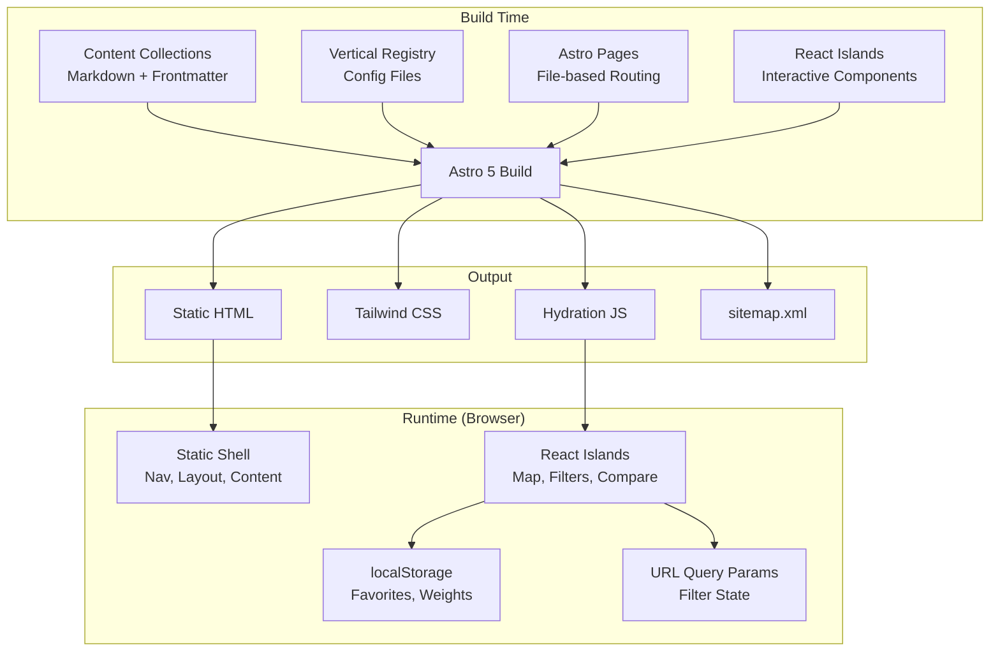
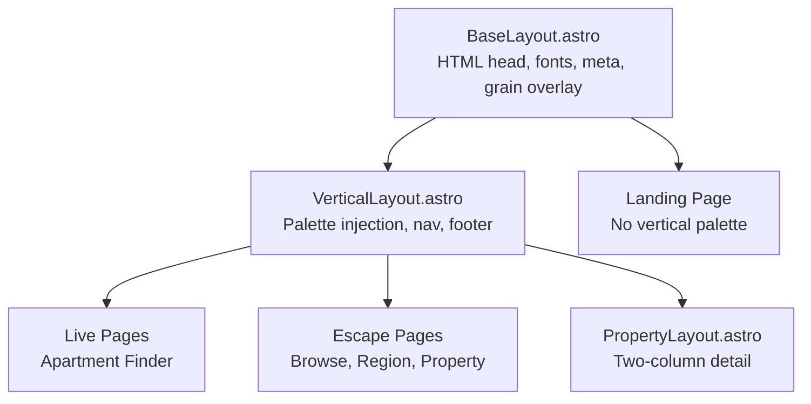

# Design Document: Astro Retreat Integration

## Overview

This design describes the migration of the Charlotte Apartment Finder from a React + Vite SPA to an Astro 5 static site, and the integration of the solo retreat guide as a second vertical. The result is "Basecamp Atlas" — a unified lifestyle discovery platform with two verticals: `/live` (apartment finder) and `/escape` (retreat guide).

### Key Design Decisions

1. **Astro 5 with React islands** — Astro handles routing, content collections, and static generation. Existing React components (map, filters, compare) render as client-side islands via `@astrojs/react`. This preserves the entire existing component library without rewrites.

2. **Vertical registry pattern** — Each section is a self-contained "vertical" with its own config, palette, content schema, and page templates. Adding a new vertical requires only configuration and content — no changes to shared infrastructure.

3. **CSS custom properties for palette switching** — Both verticals share the same design token structure but override values per-route. The active vertical's palette is applied at the layout level via a data attribute.

4. **Content collections for retreat data** — Properties, regions, origin cities, and seasonal guides are Astro content collections with Zod-validated frontmatter. The apartment data remains a static TypeScript array (no migration needed since it's already typed and small).

5. **Static output only** — No SSR adapter. Every page is pre-rendered at build time. React islands hydrate client-side for interactivity.

## Architecture

### High-Level System Diagram




### Project Structure

```
basecamp-atlas/
├── astro.config.mjs              # Astro config with @astrojs/react, sitemap, image
├── package.json                  # "basecamp-atlas"
├── tsconfig.json                 # paths: { "@/*": ["./src/*"] }
├── public/
│   ├── manifest.json
│   ├── fonts/                    # Self-hosted Playfair Display + Jost
│   └── apartment.png
├── src/
│   ├── content/                  # Astro content collections
│   │   ├── config.ts             # Collection schemas (Zod)
│   │   ├── properties/           # Retreat property .md files
│   │   │   ├── glamping-collective-ultra-luxe-dome.md
│   │   │   ├── villa-luna-mirror-cabin.md
│   │   │   └── ...
│   │   ├── regions/              # Destination region .md files
│   │   │   ├── asheville-blue-ridge.md
│   │   │   ├── smokies.md
│   │   │   └── ...
│   │   ├── origin-cities/        # Origin city .md files
│   │   │   ├── charlotte.md
│   │   │   ├── atlanta.md
│   │   │   └── ...
│   │   └── seasonal-guides/      # Seasonal editorial .md files
│   │       ├── fall-foliage.md
│   │       └── ...
│   ├── verticals/                # Vertical registry configs
│   │   ├── live.json             # Apartment finder vertical config
│   │   └── escape.json           # Retreat guide vertical config
│   ├── layouts/
│   │   ├── BaseLayout.astro      # HTML shell, meta, fonts, grain overlay
│   │   ├── VerticalLayout.astro  # Applies vertical palette + nav active state
│   │   └── PropertyLayout.astro  # Two-column property detail layout
│   ├── pages/
│   │   ├── index.astro           # Landing page (/)
│   │   ├── live/
│   │   │   └── index.astro       # Apartment finder (/live)
│   │   └── escape/
│   │       ├── index.astro       # Retreat browse (/escape)
│   │       ├── feed.xml.ts       # RSS feed for new properties
│   │       ├── [region].astro    # Region pages (/escape/[region-slug])
│   │       ├── [region]/
│   │       │   └── [property].astro  # Property detail
│   │       └── seasonal/
│   │           └── [guide].astro # Seasonal guide pages
│   ├── components/               # Feature components (React)
│   │   ├── ApartmentDetailCard.tsx
│   │   ├── ApartmentListView.tsx
│   │   ├── CompareView.tsx
│   │   ├── FilterSidebar.tsx
│   │   ├── MapView.tsx
│   │   ├── WeightEditor.tsx
│   │   ├── retreat/              # Retreat-specific React components
│   │   │   ├── RetreatBrowse.tsx # Browse + filter island
│   │   │   ├── RetreatFilterSidebar.tsx
│   │   │   └── PropertyCard.tsx
│   │   └── shared/              # Cross-vertical shared components
│   │       ├── Navigation.tsx    # Shared nav (React island)
│   │       ├── MobileMenu.tsx    # Mobile nav drawer
│   │       └── ScoreIndicator.tsx
│   ├── components/ui/            # shadcn/ui primitives (unchanged)
│   │   ├── button.tsx
│   │   ├── card.tsx
│   │   └── ... (55 files)
│   ├── data/
│   │   ├── apartments.ts         # Static apartment array (unchanged)
│   │   ├── lightrail.ts
│   │   └── neighborhoods.ts
│   ├── hooks/                    # React hooks (unchanged)
│   │   ├── use-apartment-filters.ts
│   │   ├── use-favorites.ts
│   │   ├── use-score-weights.ts
│   │   └── ...
│   ├── lib/
│   │   ├── utils.ts              # cn() utility (unchanged)
│   │   ├── verticals.ts          # Vertical registry loader
│   │   └── drive-time.ts         # Drive time formatting utilities
│   └── styles/
│       ├── global.css            # Tailwind imports + shared tokens
│       ├── palettes/
│       │   ├── live.css          # Blue-slate palette (existing)
│       │   └── escape.css        # Amber/moss/rust palette
│       └── effects.css           # Film grain, custom cursor, scroll-reveal
└── dist/                         # Static build output
```


## Components and Interfaces

### Vertical Registry System

Each vertical is defined by a JSON config file in `src/verticals/`. The registry loader reads all configs at build time and exposes them to layouts, navigation, and sitemap generation.

```typescript
// src/lib/verticals.ts
import type { VerticalConfig } from './types';

export interface VerticalConfig {
  id: string;                    // e.g. "live", "escape"
  name: string;                  // Display label, max 20 chars
  description: string;           // One-sentence description
  routePrefix: string;           // e.g. "/live", "/escape"
  palette: string;               // CSS file reference (e.g. "live.css")
  contentCollection?: string;    // Astro collection name (optional for non-content verticals)
  order: number;                 // Navigation ordering
}

// Loads all vertical configs from src/verticals/*.json
export function loadVerticals(): VerticalConfig[];

// Returns the active vertical based on current path
export function getActiveVertical(pathname: string): VerticalConfig | null;

// Validates no duplicate route prefixes (called at build time)
export function validateVerticals(configs: VerticalConfig[]): void;
```

**Example vertical config (`src/verticals/escape.json`):**
```json
{
  "id": "escape",
  "name": "Escape",
  "description": "Curated nature retreats within driving distance",
  "routePrefix": "/escape",
  "palette": "escape.css",
  "contentCollection": "properties",
  "order": 2
}
```

### React Island Strategy

Components are categorized by hydration needs:

| Component | Directive | Rationale |
|-----------|-----------|-----------|
| Navigation | `client:load` | Always visible, needs mobile menu state |
| ApartmentFinder (Map page) | `client:load` | Primary interactive content, above fold |
| RetreatBrowse (filter+list) | `client:load` | Primary interactive content on /escape |
| MapView (Leaflet) | `client:visible` | Heavy bundle, lazy-load until scrolled to |
| PropertyCard (static) | None | Rendered as static Astro component |
| MobileMenu | `client:load` | Needs immediate interactivity |

### Astro Page → React Island Boundary

```astro
---
// src/pages/live/index.astro
import VerticalLayout from '@/layouts/VerticalLayout.astro';
import ApartmentFinder from '@/components/ApartmentFinder.tsx';
---
<VerticalLayout vertical="live" title="Apartment Finder" description="...">
  <ApartmentFinder client:load />
</VerticalLayout>
```

The `ApartmentFinder` component wraps the existing `Map.tsx` page logic (filters, favorites, compare, map/list toggle) as a single island. This preserves all existing state management (URL sync, localStorage) without changes.


### Shared Navigation Component

```typescript
// src/components/shared/Navigation.tsx
interface NavigationProps {
  verticals: VerticalConfig[];
  activeVertical: string | null;  // Current vertical ID or null for landing
}
```

The navigation renders as a fixed-position bar with:
- Brand mark ("Basecamp Atlas") linking to `/`
- Vertical links derived from the registry (ordered by `config.order`)
- Active state indicated by the vertical's accent color on the link
- Mobile: collapses to hamburger menu with focus trap and keyboard nav

### Layout Hierarchy



### Retreat Browse Island

The retreat browse page (`/escape`) uses a React island similar to the apartment finder pattern:

```typescript
// src/components/retreat/RetreatBrowse.tsx
interface RetreatBrowseProps {
  properties: SerializedProperty[];  // Passed from Astro page as JSON
  regions: SerializedRegion[];
  originCities: SerializedOriginCity[];
}

interface RetreatFilterState {
  regions: string[];           // Multi-select region slugs
  stayTypes: string[];         // Multi-select stay types
  priceRange: [number, number]; // $50–$1500, $25 increments
  maxDriveTime: number;        // Minutes, from selected origin
  selectedOrigin: string;      // Origin city slug
  minPrivacy: number;          // 1–5
  amenities: string[];         // Checkbox selections
}
```

Filter state syncs to URL query params via `history.replaceState` (same pattern as `useApartmentFilters`). Only non-default values are serialized.

## Data Models

### Content Collection Schemas

```typescript
// src/content/config.ts
import { defineCollection, z, reference } from 'astro:content';

const properties = defineCollection({
  type: 'content',
  schema: z.object({
    name: z.string().max(100),
    slug: z.string().regex(/^[a-z0-9-]+$/).max(60),
    region: z.string(),  // Must match a region slug
    stayType: z.string().min(1).max(50),
    priceRange: z.object({
      min: z.number().int().min(1).max(9999),
      max: z.number().int().min(1).max(9999),
    }),
    driveTimes: z.record(z.string(), z.number().int()),  // origin-slug → minutes
    privacyLevel: z.number().int().min(3).max(5),  // Curation: min 3
    amenities: z.array(z.string()).min(1),
    wowFactor: z.string().min(20).max(300),
    bookingUrl: z.string().url(),
    coordinates: z.object({
      lat: z.number(),
      lng: z.number(),
    }),
    nearbyHikes: z.array(z.object({
      name: z.string().max(100),
      distance: z.string().max(30).optional(),
    })).min(1).max(20),
    seasonalTags: z.array(z.string()).max(10).optional(),
    lastVerified: z.coerce.date().optional(),  // Trust signal: when pricing/availability was last checked
    roadAccess: z.enum(['sedan-friendly']),  // Curation: only sedan-friendly
  }).refine(
    (data) => data.amenities.some(a =>
      a.toLowerCase().includes('hot tub') || a.toLowerCase().includes('soaking tub')
    ),
    { message: 'Curation standard: property must have hot tub or soaking tub' }
  ),
});


const regions = defineCollection({
  type: 'content',
  schema: z.object({
    name: z.string(),
    slug: z.string().regex(/^[a-z0-9-]+$/),
    description: z.string().min(50),
    highlights: z.array(z.string()).min(1),  // Activities/attractions
    coordinates: z.object({
      lat: z.number(),
      lng: z.number(),
    }),
  }),
});

const originCities = defineCollection({
  type: 'data',  // JSON/YAML, no Markdown body
  schema: z.object({
    name: z.string(),
    slug: z.string().regex(/^[a-z0-9-]+$/),
    coordinates: z.object({
      lat: z.number(),
      lng: z.number(),
    }),
  }),
});

const seasonalGuides = defineCollection({
  type: 'content',
  schema: z.object({
    title: z.string(),
    slug: z.string().regex(/^[a-z0-9-]+$/),
    season: z.enum(['spring', 'summer', 'fall', 'winter']),
    featuredProperties: z.array(z.string()).min(3).max(10),  // Property slugs
    description: z.string().min(50).max(300),
  }),
});

export const collections = { properties, regions, originCities, seasonalGuides };
```

### Example Property Frontmatter

```markdown
---
name: "The Glamping Collective Ultra Luxe Dome"
slug: "glamping-collective-ultra-luxe-dome"
region: "asheville-blue-ridge"
stayType: "geodesic dome"
priceRange:
  min: 275
  max: 330
driveTimes:
  charlotte: 150
  atlanta: 210
  nashville: 270
  richmond: 330
  charleston-wv: 240
  greenville: 180
  raleigh: 270
  asheville: 30
privacyLevel: 4
amenities:
  - "hot tub"
  - "fire table"
  - "king bed"
  - "heated floors"
  - "slate tile shower"
  - "kitchenette"
  - "robes and slippers"
wowFactor: "A 23-foot geodesic dome perched at 4,334 feet with 40-mile Blue Ridge views and a private hot tub under the dome panels at night."
bookingUrl: "https://www.theglampingcollective.com/locations/asheville/ultra-luxe-dome/"
coordinates:
  lat: 35.5654
  lng: -82.9832
nearbyHikes:
  - name: "Sunset Summit (on-property, guests-only)"
  - name: "DuPont State Forest — Triple Falls"
    distance: "45 min drive"
  - name: "Black Balsam Knob"
    distance: "1h drive"
  - name: "Max Patch"
    distance: "1h drive"
seasonalTags: ["fall", "winter"]
roadAccess: "sedan-friendly"
---

The Ultra Luxe is the highest-privacy tier on a 160-acre mountaintop property...
```

### Apartment Data (Unchanged)

The existing `src/data/apartments.ts` remains as-is. The 37-apartment static array with the `Apartment` interface continues to serve the `/live` vertical. No content collection migration is needed — the data is small, typed, and doesn't benefit from Markdown editorial content.

### Vertical Config Schema

```typescript
// Validated at build time by src/lib/verticals.ts
const verticalConfigSchema = z.object({
  id: z.string().regex(/^[a-z0-9-]+$/),
  name: z.string().max(20),
  description: z.string(),
  routePrefix: z.string().startsWith('/'),
  palette: z.string(),
  contentCollection: z.string().optional(),
  order: z.number().int().min(0),
});
```


## Shared Design System Architecture

### Typography

Both verticals share the same font stack:
- **Headings (h1–h6):** Playfair Display (400, 700, 900, italic)
- **Body:** Jost (200, 300, 400)

Fonts are self-hosted in `public/fonts/` for performance and loaded via `@font-face` in `global.css`.

### Palette Switching via CSS Custom Properties

The design system uses a two-layer token architecture:

**Layer 1: Semantic tokens** (shared structure, defined in `global.css`)
```css
:root {
  /* Semantic tokens — same names, different values per vertical */
  --surface-base: var(--palette-surface-base);
  --surface-elevated: var(--palette-surface-elevated);
  --surface-overlay: var(--palette-surface-overlay);
  --text-primary: var(--palette-text-primary);
  --text-secondary: var(--palette-text-secondary);
  --text-muted: var(--palette-text-muted);
  --accent-primary: var(--palette-accent-primary);
  --accent-secondary: var(--palette-accent-secondary);
  --accent-tertiary: var(--palette-accent-tertiary);
  --border-subtle: var(--palette-border-subtle);
  --border-default: var(--palette-border-default);
}
```

**Layer 2: Palette values** (vertical-specific, applied via `[data-vertical]` attribute)

```css
/* src/styles/palettes/live.css — Blue-slate (existing apartment finder) */
[data-vertical="live"] {
  --palette-surface-base: hsl(222 47% 11%);      /* #0f172a */
  --palette-surface-elevated: hsl(217 32% 17%);  /* #1e293b */
  --palette-surface-overlay: hsl(216 34% 17%);
  --palette-text-primary: hsl(213 31% 91%);
  --palette-text-secondary: hsl(215 20% 65%);
  --palette-text-muted: hsl(215 16% 47%);
  --palette-accent-primary: hsl(199 89% 48%);    /* Cyan/blue */
  --palette-accent-secondary: hsl(286 65% 58%);
  --palette-accent-tertiary: hsl(340 75% 55%);
  --palette-border-subtle: hsl(216 34% 17%);
  --palette-border-default: hsl(216 34% 22%);
}

/* src/styles/palettes/escape.css — Amber/moss/rust (retreat guide) */
[data-vertical="escape"] {
  --palette-surface-base: #0d0c0a;               /* Near-black warm */
  --palette-surface-elevated: #1a1814;           /* Charcoal */
  --palette-surface-overlay: #231f1a;            /* Warm dark */
  --palette-text-primary: #f5f1ea;              /* Warm white */
  --palette-text-secondary: #e8e0d0;            /* Cream */
  --palette-text-muted: #6b6358;                /* Ash */
  --palette-accent-primary: #c8943a;            /* Amber */
  --palette-accent-secondary: #6b7c5a;          /* Moss */
  --palette-accent-tertiary: #a0543a;           /* Rust */
  --palette-border-subtle: rgba(58,53,48,0.6);
  --palette-border-default: rgba(184,169,142,0.1);
}
```

Both palettes maintain background lightness ≤ 11% HSL for the cinematic dark aesthetic.

### Palette Application in Layout

```astro
---
// src/layouts/VerticalLayout.astro
import BaseLayout from './BaseLayout.astro';
import Navigation from '@/components/shared/Navigation.tsx';
import { loadVerticals, getActiveVertical } from '@/lib/verticals';

const { vertical, title, description } = Astro.props;
const verticals = loadVerticals();
const activeVertical = getActiveVertical(Astro.url.pathname);
---
<BaseLayout title={title} description={description}>
  <div data-vertical={vertical}>
    <Navigation client:load verticals={verticals} activeVertical={vertical} />
    <main>
      <slot />
    </main>
  </div>
</BaseLayout>
```

### Cinematic Effects (Opt-in CSS Classes)

The retreat guide's signature effects are extracted as utility classes, inactive by default:

```css
/* src/styles/effects.css */

/* Film grain overlay — add class="grain-overlay" to a container */
.grain-overlay::after {
  content: '';
  position: fixed;
  inset: 0;
  pointer-events: none;
  z-index: 1000;
  background-image: url("data:image/svg+xml,...");  /* fractalNoise SVG */
  opacity: 0.35;
  mix-blend-mode: overlay;
}

/* Custom cursor — add class="custom-cursor" to body or container */
.custom-cursor { cursor: none; }
.custom-cursor .cursor-dot { /* amber dot styles */ }
.custom-cursor .cursor-ring { /* lagging ring styles */ }

/* Scroll-reveal — add class="scroll-reveal" to elements */
.scroll-reveal {
  opacity: 0;
  transform: translateY(40px);
  transition: opacity 0.8s ease, transform 0.8s ease;
}
.scroll-reveal.visible {
  opacity: 1;
  transform: translateY(0);
}
```

### Component Sharing Strategy

Shared components accept theming via CSS custom properties (not props):

| Component | Shared? | Theming Approach |
|-----------|---------|-----------------|
| Card | Yes | Uses `--surface-elevated`, `--border-subtle` |
| FilterSidebar | Pattern shared, impl separate | Same layout structure, different filter fields |
| MapView | Yes (Leaflet) | Tile layer + marker colors from CSS vars |
| ScoreIndicator | Yes | Dots/bars colored by `--accent-primary` |
| Navigation | Yes | Active link uses vertical's `--accent-primary` |
| Button, Badge, etc. | Yes (shadcn/ui) | Already use CSS custom properties |
| PropertyCard | Escape only | Uses escape palette tokens |
| ApartmentDetailCard | Live only | Uses live palette tokens |

The shadcn/ui components (`src/components/ui/`) require zero changes — they already consume CSS custom properties via the `hsl(var(--...))` pattern. The semantic token layer maps to the same variable names they expect.


### Build and Deployment Pipeline

```mermaid
graph LR
    subgraph "Development"
        Dev[npm run dev] --> AstroDev[Astro Dev Server<br/>HMR + React Fast Refresh]
    end

    subgraph "Build"
        Build[npm run build] --> Validate[Validate Verticals<br/>+ Content Schemas]
        Validate --> Generate[Generate Static Pages<br/>+ Optimize Images]
        Generate --> Sitemap[Generate sitemap.xml]
        Sitemap --> Output[dist/ directory]
    end

    subgraph "Deploy"
        Output --> Vercel[Vercel / Cloudflare Pages<br/>Static hosting]
    end
```

**Astro Configuration:**

```javascript
// astro.config.mjs
import { defineConfig } from 'astro/config';
import react from '@astrojs/react';
import sitemap from '@astrojs/sitemap';
import tailwindcss from '@tailwindcss/vite';

export default defineConfig({
  site: 'https://basecamp-atlas.vercel.app',  // or custom domain
  output: 'static',  // No SSR adapter
  prefetch: {
    defaultStrategy: 'hover',  // Preload pages on link hover for instant nav
  },
  integrations: [
    react(),
    sitemap(),
  ],
  vite: {
    plugins: [tailwindcss()],
    resolve: {
      alias: { '@': '/src' },
    },
  },
  image: {
    service: { entrypoint: 'astro/assets/services/sharp' },
  },
});
```

**Key build characteristics:**
- Output: `static` (pre-rendered HTML only, no Node.js runtime)
- Tailwind CSS v4 via `@tailwindcss/vite` plugin (no config file, consistent with current setup)
- Image optimization via Astro's built-in Sharp service (WebP/AVIF output)
- Sitemap auto-generated from all static routes
- Build target: < 120 seconds for up to 200 content pages
- `@/` path alias preserved for all imports

**Scripts:**
```json
{
  "scripts": {
    "dev": "astro dev",
    "build": "astro build",
    "preview": "astro preview",
    "typecheck": "astro check && tsc --noEmit"
  }
}
```

### Content Validation at Build Time

Astro's content collections provide build-time validation automatically. When a Markdown file has invalid frontmatter, the build fails with a clear error message identifying the file and field. Additional custom validations run during the build:

1. **Vertical registry validation** — Checks for duplicate route prefixes, missing required fields
2. **Seasonal guide cross-references** — Verifies all `featuredProperties` slugs resolve to existing property files
3. **Region visibility** — Regions with zero published properties are excluded from navigation and browse pages (not a build error, just hidden)
4. **Curation standards** — Enforced via Zod schema refinements (privacy ≥ 3, hot tub required, sedan-friendly only)

### SEO and Meta

Every page includes:
- `<title>` with page-specific content
- `<meta name="description">` 
- Open Graph tags: `og:title`, `og:description`, `og:type`, `og:url`
- `<link rel="canonical">` with absolute URL
- Landing page includes JSON-LD (`WebSite` schema with `SearchAction`)

Meta tags are set in `BaseLayout.astro` with props passed from each page.


## Correctness Properties

*A property is a characteristic or behavior that should hold true across all valid executions of a system — essentially, a formal statement about what the system should do. Properties serve as the bridge between human-readable specifications and machine-verifiable correctness guarantees.*

### Property 1: Apartment filter state URL round-trip

*For any* valid apartment filter state (rent range, neighborhoods, washer/dryer, score minimums, sort option), serializing the state to URL query parameters and parsing it back SHALL produce an equivalent filter state. Additionally, filter parameters that match default values SHALL be omitted from the URL.

**Validates: Requirements 2.4, 2.8**

### Property 2: Weighted score calculation correctness

*For any* apartment with safety, walkability, transit, and entertainment scores (each 1–10), and *for any* valid weight configuration where all weights sum to 1.0, the calculated overall score SHALL equal the sum of (score × weight) for each category, rounded to one decimal place.

**Validates: Requirements 2.5**

### Property 3: CSV export round-trip

*For any* non-empty subset of apartments, exporting to CSV and parsing the CSV back SHALL produce records containing the same apartment names, addresses, neighborhoods, rent ranges, and scores as the input set, with no data loss or corruption.

**Validates: Requirements 2.3**

### Property 4: Content schema validation

*For any* property object with all required fields within valid ranges (name ≤ 100 chars, slug matching pattern, privacy 3–5, price 1–9999, amenities including hot tub/soaking tub, road access "sedan-friendly", wow factor 20–300 chars, valid booking URL, at least 1 nearby hike), the schema SHALL accept it. *For any* property object missing a required field or with a value outside valid ranges, the schema SHALL reject it with an error identifying the invalid field.

**Validates: Requirements 3.2, 3.3, 8.1, 8.2, 8.3, 8.4, 8.5, 8.6**

### Property 5: Retreat filter correctness

*For any* set of retreat properties and *for any* valid filter state (regions, stay types, price range, max drive time from origin, minimum privacy, amenities), applying the filter SHALL return exactly those properties that satisfy ALL active filter criteria simultaneously. Stay type matching SHALL be case-insensitive. The result count SHALL equal the length of the filtered array.

**Validates: Requirements 5.2, 5.6, 7.3, 4.3**

### Property 6: Retreat filter state URL round-trip

*For any* valid retreat filter state (regions, stay types, price range, max drive time, selected origin, minimum privacy, amenities), serializing to URL query parameters and parsing back SHALL produce an equivalent filter state. Parameters matching default values SHALL be omitted from the URL.

**Validates: Requirements 5.4, 5.8**

### Property 7: Drive time formatting

*For any* integer number of minutes (1–600), formatting as a drive time string SHALL produce a string matching the pattern "Xh Ym" where X = floor(minutes/60) and Y = minutes mod 60. For values under 60 minutes, the format SHALL be "Ym" (no hours component). Parsing the formatted string back SHALL recover the original minute value.

**Validates: Requirements 4.4**

### Property 8: Route-to-vertical mapping

*For any* URL pathname, `getActiveVertical` SHALL return the vertical whose `routePrefix` is a prefix of the pathname, or null if no vertical matches. *For any* two verticals with distinct route prefixes, the mapping SHALL be unambiguous (longest prefix match).

**Validates: Requirements 6.5, 10.2**

### Property 9: Vertical config validation

*For any* set of vertical configurations, validation SHALL pass if and only if: all configs have non-empty id, name (≤ 20 chars), routePrefix (starting with "/"), and palette fields; AND no two configs share the same routePrefix. *For any* set with duplicate route prefixes or missing required fields, validation SHALL fail with an error identifying the conflict.

**Validates: Requirements 14.1, 14.5, 14.8, 14.9**

### Property 10: Empty regions excluded from navigation

*For any* set of destination regions and properties, the navigation and browse page SHALL include only those regions that have at least one published property with a matching region slug. Regions with zero matching properties SHALL not appear.

**Validates: Requirements 4.8**

### Property 11: Static output completeness

*For any* set of content collection entries (properties, regions, seasonal guides) and registered verticals, the built output SHALL contain: (a) an HTML file for every content route, (b) a sitemap.xml entry with the correct URL for every content route, (c) meta tags (title, description, og:title, og:description, og:type, og:url) in every HTML file, and (d) a `<link rel="canonical">` with absolute URL in every HTML file.

**Validates: Requirements 11.2, 11.3, 11.4, 15.8, 15.9**

### Property 12: Property detail rendering completeness

*For any* valid property, the rendered detail page SHALL contain: property name, stay type, region name, editorial body, all amenities, privacy level indicator, price range, drive times from all origin cities (sorted shortest first), nearby hikes list, road access notes, wow factor callout, and booking link. *For any* property with absent optional fields (seasonal tags, coordinates), those sections SHALL not appear in the rendered output (no empty containers or placeholder text).

**Validates: Requirements 13.2, 13.5**

### Property 13: Seasonal guide property resolution

*For any* seasonal guide with a list of featured property slugs, resolving those slugs against the property collection SHALL return the corresponding property objects for all valid slugs. *For any* slug that does not match an existing property, resolution SHALL produce an error identifying the guide and the unresolved slug.

**Validates: Requirements 9.2, 9.3**


## Easy Wins

### Content & Discovery Enhancements

**1. "Surprise Me" Random Property**

A button on the `/escape` browse page that selects a random property from the currently filtered set and navigates to its detail page. Implemented as a single function in the `RetreatBrowse` island:

```typescript
const handleSurpriseMe = () => {
  const randomIndex = Math.floor(Math.random() * filteredProperties.length);
  window.location.href = `/escape/${filteredProperties[randomIndex].region}/${filteredProperties[randomIndex].slug}`;
};
```

**2. Retreat Property Comparison**

Reuse the existing `CompareView` pattern from the apartment finder. Users can "star" retreat properties and compare them side-by-side with columns for: price range, privacy level, drive times, amenities, wow factor, and stay type. Stored in localStorage with key `escape-compare`.

**3. "Weekend from [City]" Quick Filters**

Pre-built filter presets rendered as cards on the landing page and `/escape` browse page:
- "Weekend from Charlotte (< 3h)" → `/escape?origin=charlotte&maxDrive=180`
- "Weekend from Atlanta (< 3h)" → `/escape?origin=atlanta&maxDrive=180`
- "Weekend from Nashville (< 3h)" → `/escape?origin=nashville&maxDrive=180`

These are just URL shortcuts — no new logic needed. The existing filter URL parsing handles them automatically.

### SEO & Performance Enhancements

**4. RSS Feed for New Properties**

Astro's `@astrojs/rss` integration generates an RSS feed from the properties content collection. Users can subscribe to get notified when new properties are added.

```javascript
// src/pages/escape/feed.xml.ts
import rss from '@astrojs/rss';
import { getCollection } from 'astro:content';

export async function GET(context) {
  const properties = await getCollection('properties');
  return rss({
    title: 'Basecamp Atlas — New Retreats',
    description: 'Curated nature retreats added to the collection',
    site: context.site,
    items: properties.map(p => ({
      title: p.data.name,
      description: p.data.wowFactor,
      link: `/escape/${p.data.region}/${p.data.slug}`,
    })),
  });
}
```

**5. View Transitions**

Astro's built-in `<ViewTransitions />` component provides smooth cross-page animations. Added to `BaseLayout.astro`:

```astro
---
import { ViewTransitions } from 'astro:transitions';
---
<head>
  <ViewTransitions />
</head>
```

This gives fade/morph transitions between pages with zero additional JavaScript. Navigation feels instant and app-like.

**6. Prefetch on Hover**

Astro's prefetch integration preloads linked pages when the user hovers over a link, making navigation feel near-instant:

```javascript
// astro.config.mjs
export default defineConfig({
  prefetch: {
    defaultStrategy: 'hover',
  },
  // ...
});
```

### Design & Polish Enhancements

**7. Dark Mode Map Tiles**

Replace default OpenStreetMap tiles with CartoDB Dark Matter (free, no API key):

```typescript
// In MapView component
const DARK_TILES = 'https://{s}.basemaps.cartocdn.com/dark_all/{z}/{x}/{y}{r}.png';
const DARK_ATTRIBUTION = '&copy; OpenStreetMap contributors &copy; CARTO';
```

This matches the cinematic dark aesthetic of both verticals without any tile server costs.

**8. Scroll Progress Indicator**

A thin accent-colored bar at the top of property detail pages showing read progress:

```css
.scroll-progress {
  position: fixed;
  top: 0;
  left: 0;
  height: 3px;
  background: var(--accent-primary);
  z-index: 9999;
  transition: width 50ms linear;
}
```

Driven by a small scroll event listener (~8 lines of JS) that updates `width` based on scroll percentage.

**9. "Back to Top" Button**

Appears after scrolling past the fold on region and browse pages. Uses `scroll-reveal` pattern (fades in) and smooth-scrolls to top on click. Positioned fixed bottom-right with the vertical's accent color.

### Data & Utility Enhancements

**10. Property Count Badges on Region Cards**

Each region card on the browse page and landing page shows the number of properties in that region. Computed at build time from the content collection — zero runtime cost:

```astro
---
const properties = await getCollection('properties');
const countByRegion = properties.reduce((acc, p) => {
  acc[p.data.region] = (acc[p.data.region] || 0) + 1;
  return acc;
}, {} as Record<string, number>);
---
```

**11. Last Verified Timestamp**

An optional `lastVerified` date field in property frontmatter. Displayed on the property detail page as "Last verified: Oct 2024". Builds trust that pricing and availability info is current.

```typescript
// Added to property schema
lastVerified: z.coerce.date().optional(),
```

**12. Share Button on Property Pages**

Uses the Web Share API with clipboard fallback:

```typescript
const handleShare = async () => {
  const shareData = { title: property.name, url: window.location.href };
  if (navigator.share) {
    await navigator.share(shareData);
  } else {
    await navigator.clipboard.writeText(window.location.href);
    // Show toast: "Link copied"
  }
};
```

Renders as a small icon button in the property detail page header. ~10 lines of implementation.

---

## Error Handling

### Build-Time Errors

| Error Condition | Source | Message Format |
|----------------|--------|----------------|
| Invalid property frontmatter | Astro content collection | `[properties] Invalid frontmatter in {file}: {field} — {reason}` |
| Invalid region frontmatter | Astro content collection | `[regions] Invalid frontmatter in {file}: {field} — {reason}` |
| Invalid seasonal guide frontmatter | Astro content collection | `[seasonalGuides] Invalid frontmatter in {file}: {field} — {reason}` |
| Unresolved property slug in seasonal guide | Custom build validation | `[seasonalGuides] {guide-file} references unknown property slug: "{slug}"` |
| Duplicate vertical route prefix | Vertical registry validation | `[verticals] Duplicate routePrefix "/{prefix}" in {file1} and {file2}` |
| Invalid vertical config | Vertical registry validation | `[verticals] Invalid config in {file}: missing required field "{field}"` |
| Curation standard violation | Zod schema refinement | `[properties] {file} fails curation: {reason}` (e.g., "privacy level 2 is below minimum 3") |

All build-time errors halt the build and produce a non-zero exit code. Error messages always identify the offending file and the specific field/reason.

### Runtime Error Handling

| Scenario | Handling |
|----------|----------|
| localStorage unavailable (private browsing) | Favorites/weights degrade gracefully — features work in-memory without persistence. No error shown to user. |
| Invalid URL query parameters | Ignore invalid params, use defaults for those fields. No error shown. |
| Leaflet map fails to load | Suspense fallback shows loading state. If tiles fail, map renders with error boundary showing "Map unavailable" message. |
| Image optimization fails | Astro falls back to original image format. Build continues with warning. |
| Content collection empty | Pages render with empty state messages (e.g., "No properties found"). Not a build error. |

### Graceful Degradation

- React islands that fail to hydrate: Static HTML content remains visible. Interactive features (filters, map) show a "Loading..." state that never resolves, but the page is still navigable.
- JavaScript disabled: All content pages render as static HTML with full editorial content visible. Interactive features (filtering, map, compare) are unavailable but content is accessible.
- CSS custom properties unsupported: Falls back to hardcoded values in the compiled Tailwind output.

## Testing Strategy

### Property-Based Testing

**Library:** [fast-check](https://github.com/dubzzz/fast-check) (TypeScript, integrates with Vitest)

**Configuration:** Minimum 100 iterations per property test.

**Tag format:** Each test is annotated with:
```typescript
// Feature: astro-retreat-integration, Property {N}: {property_text}
```

**Properties to implement as PBT:**

| Property | Module Under Test | Generator Strategy |
|----------|-------------------|-------------------|
| 1: Filter URL round-trip | `use-apartment-filters.ts` (serialize/parse) | Random FilterState objects with valid ranges |
| 2: Weighted score | `use-score-weights.ts` (calculateScore) | Random Apartment + random weights summing to 1.0 |
| 3: CSV export round-trip | CSV export utility | Random apartment subsets |
| 4: Content schema validation | `src/content/config.ts` (Zod schema) | Random valid/invalid property objects |
| 5: Retreat filter correctness | Retreat filter logic | Random property arrays + random filter states |
| 6: Retreat filter URL round-trip | Retreat filter URL serialize/parse | Random RetreatFilterState objects |
| 7: Drive time formatting | `src/lib/drive-time.ts` | Random integers 1–600 |
| 8: Route-to-vertical mapping | `src/lib/verticals.ts` (getActiveVertical) | Random URL paths + random vertical configs |
| 9: Vertical config validation | `src/lib/verticals.ts` (validateVerticals) | Random valid/invalid config sets |
| 10: Empty regions excluded | Region visibility logic | Random region/property sets |
| 13: Seasonal guide resolution | Slug resolution utility | Random property sets + slug lists |

**Properties 11 and 12** are integration-level (require full build output) and are better tested as post-build assertions rather than fast-check property tests. They will be implemented as build verification tests that iterate over all output files.

### Unit Tests (Example-Based)

- shadcn/ui component rendering (smoke tests for each component)
- Navigation active state at specific routes
- Mobile menu accessibility (focus trap, keyboard nav, aria-expanded)
- Landing page JSON-LD structure
- Specific filter edge cases (empty results, reset behavior)
- Breadcrumb generation for property detail pages

### Integration Tests

- Full build produces expected file structure
- Adding a new property file → appears on browse page after rebuild
- Adding a new vertical config → appears in navigation after rebuild
- Image optimization produces WebP/AVIF output
- Sitemap contains all expected URLs

### Test Runner

**Vitest** with `@testing-library/react` for component tests. Property tests use `fast-check` integrated via Vitest's test runner. No separate test framework needed.

```json
{
  "devDependencies": {
    "vitest": "^2.0.0",
    "fast-check": "^3.0.0",
    "@testing-library/react": "^16.0.0",
    "@testing-library/jest-dom": "^6.0.0"
  }
}
```
