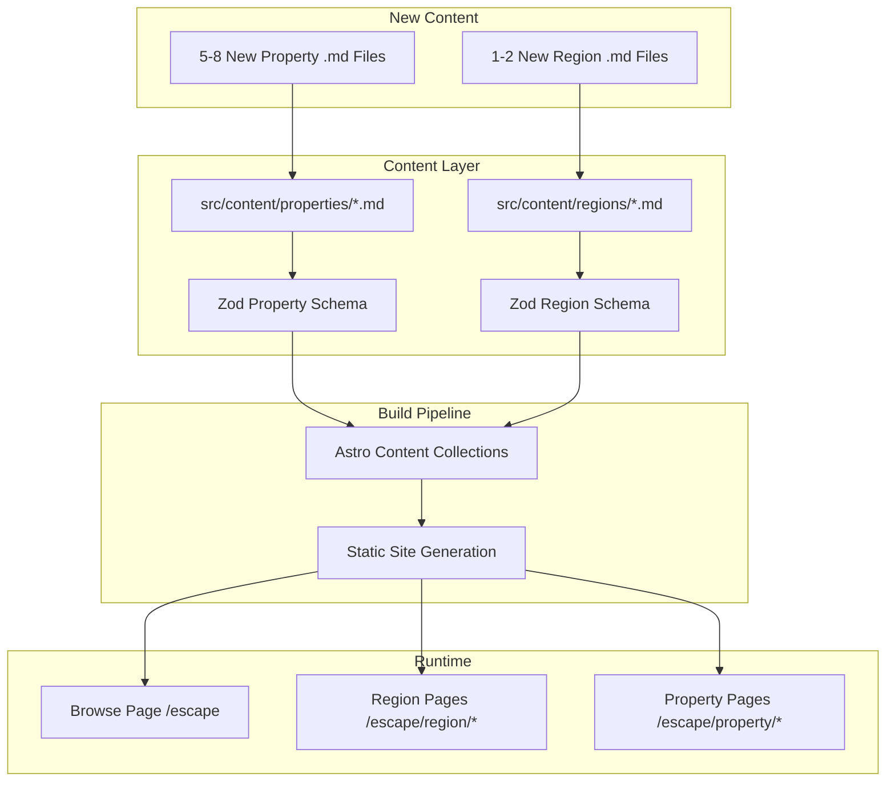
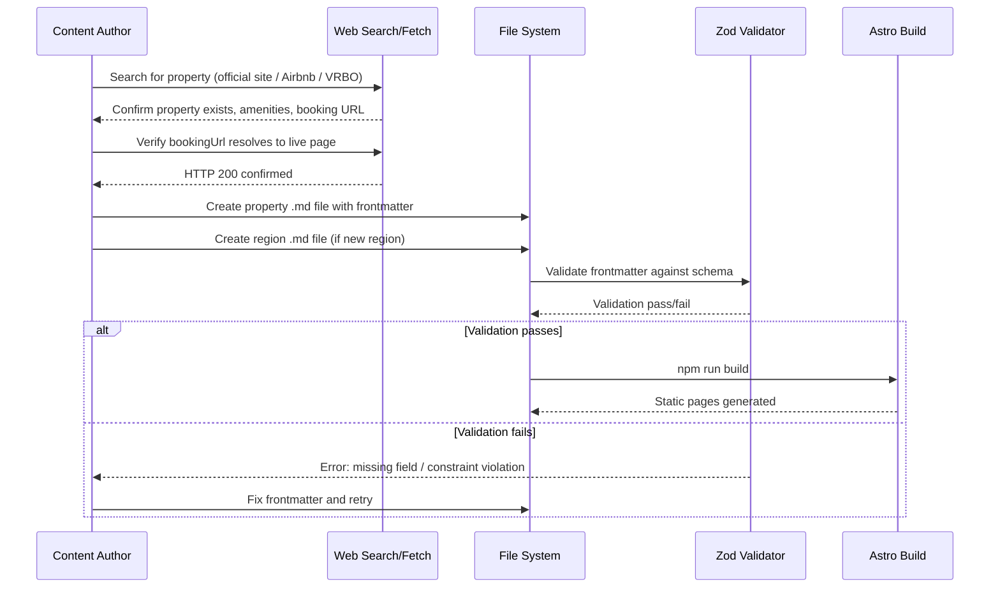
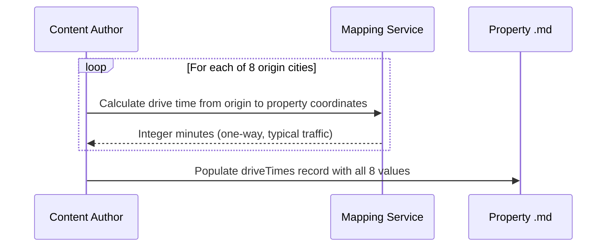

# Design Document: Retreat Property Expansion

## Overview

The /escape vertical currently features 22 curated retreat properties across 7 Southeast Appalachian regions. While the existing collection is high-quality, the geographic concentration limits appeal for users outside the immediate Southeast corridor. This feature expands the property catalog by 5–8 verified properties with geographic spread into 1–2 new regions, while maintaining strict curation standards (privacy ≥ 3, hot tub/soaking tub, sedan-friendly access, direct booking URL, verified existence).

Every new property must be verified as real via its official website or Airbnb/VRBO listing. The expansion prioritizes properties with saunas, strong views, proximity to activities (restaurants, breweries, outfitters), and quality hiking access. New properties are added as Markdown files conforming to the existing Zod schema — no code changes required beyond optional new region files.

The expansion targets regions that remain within reasonable drive time of the 8 origin cities (charlotte, atlanta, nashville, richmond, charleston-wv, greenville, raleigh, asheville) while introducing geographic diversity beyond the current Appalachian cluster.

## Architecture



## Sequence Diagrams

### Property Addition Workflow



### Drive Time Calculation Workflow



## Components and Interfaces

### Component 1: Property Content File

**Purpose**: Defines a single curated retreat property as a Markdown file with Zod-validated frontmatter and editorial body content.

**Interface**:
```typescript
// Frontmatter shape (validated by Zod at build time)
interface PropertyFrontmatter {
  name: string;              // max 100 chars
  slug: string;              // kebab-case, used for URL
  region: string;            // must match a region slug
  stayType: string;          // 1-50 chars (cabin, treehouse, A-frame, dome, yurt, etc.)
  priceRange: {
    min: number;             // int, 1-9999
    max: number;             // int, 1-9999
  };
  driveTimes: Record<string, number>;  // 8 origin cities → integer minutes
  privacyLevel: number;      // int, 3-5
  amenities: string[];       // min 1, must include "hot tub" or "soaking tub"
  wowFactor: string;         // 20-300 chars
  bookingUrl: string;        // valid URL, direct booking link
  coordinates: {
    lat: number;
    lng: number;
  };
  nearbyHikes: Array<{
    name: string;            // max 100 chars
    distance?: string;       // max 30 chars, e.g. "25 min drive"
  }>;                        // 1-20 items
  seasonalTags?: string[];   // max 10
  lastVerified?: Date;
  roadAccess: 'sedan-friendly';
}
```

**Responsibilities**:
- Store all structured property metadata in frontmatter
- Provide editorial body content (experience description, highlights, space details, best-for, getting-there)
- Pass Zod schema validation at build time
- Integrate automatically with browse, region, and property pages

### Component 2: Region Content File

**Purpose**: Defines a geographic region that groups properties and provides regional context.

**Interface**:
```typescript
interface RegionFrontmatter {
  name: string;
  slug: string;              // kebab-case, used for URL and property.region reference
  description: string;       // min 50 chars
  highlights: string[];      // min 1 item
  coordinates: {
    lat: number;
    lng: number;
  };
}
```

**Responsibilities**:
- Define region identity and geographic center
- Provide editorial description and highlight list
- Serve as grouping key for properties (property.region → region.slug)
- Auto-register in navigation and browse page

### Component 3: Verification Pipeline (Manual Process)

**Purpose**: Ensures every property is real, bookable, and accurately described before inclusion.

**Responsibilities**:
- Confirm property exists via official website or listing platform
- Verify bookingUrl resolves to a live page (HTTP 200)
- Confirm amenities listed match what the property actually offers
- Validate coordinates place the property in the correct geographic area
- Confirm road access is sedan-friendly (no 4WD-only roads)

## Data Models

### Property File Naming Convention

```typescript
// File: src/content/properties/{slug}.md
// slug = kebab-case property name, unique across all properties
// Examples: "bolt-farm-luxe-dome", "skyline-yurt", "modcabins-a-frame"
type PropertyFileName = `${string}.md`;
```

**Validation Rules**:
- Filename must match the `slug` field in frontmatter
- Slug must be unique across all property files
- Slug must be URL-safe (lowercase, hyphens only)

### Region File Naming Convention

```typescript
// File: src/content/regions/{slug}.md
// slug = kebab-case region name
// Examples: "asheville-blue-ridge", "finger-lakes-ny"
type RegionFileName = `${string}.md`;
```

**Validation Rules**:
- Filename must match the `slug` field in frontmatter
- Slug must be unique across all region files
- At least one property must reference this region slug

### Drive Times Record

```typescript
// All 8 origin cities must be present for every property
const REQUIRED_ORIGINS = [
  'charlotte', 'atlanta', 'nashville', 'richmond',
  'charleston-wv', 'greenville', 'raleigh', 'asheville'
] as const;

type DriveTimes = Record<typeof REQUIRED_ORIGINS[number], number>;
```

### Curation Standards (Enforced by Schema)

```typescript
interface CurationStandards {
  privacyLevel: 3 | 4 | 5;                    // minimum 3
  amenities: string[] & HasHotTubOrSoakingTub; // refinement check
  roadAccess: 'sedan-friendly';                // only allowed value
  wowFactor: string & { length: 20..300 };     // character bounds
  bookingUrl: URL & DirectBookingLink;         // no aggregator homepages
}
```

## Algorithmic Pseudocode

### Property Verification Algorithm

```typescript
async function verifyProperty(candidate: PropertyCandidate): Promise<VerificationResult> {
  // Step 1: Verify booking URL resolves
  const urlCheck = await fetch(candidate.bookingUrl, { method: 'HEAD' });
  if (!urlCheck.ok) {
    return { valid: false, reason: `bookingUrl returned ${urlCheck.status}` };
  }

  // Step 2: Verify URL is direct (not aggregator homepage)
  const BLOCKED_DOMAINS = ['airbnb.com', 'vrbo.com', 'booking.com', 'expedia.com'];
  const url = new URL(candidate.bookingUrl);
  const isDomainBlocked = BLOCKED_DOMAINS.some(d => url.hostname === d || url.hostname === `www.${d}`);
  // Aggregator homepages blocked; specific listing URLs on Airbnb/VRBO are allowed
  if (isDomainBlocked && !url.pathname.match(/\/rooms\/\d+|\/\d+\?/)) {
    return { valid: false, reason: 'bookingUrl points to aggregator homepage, not specific listing' };
  }

  // Step 3: Verify amenities include hot tub or soaking tub
  const hasRequiredAmenity = candidate.amenities.some(a =>
    a.toLowerCase().includes('hot tub') || a.toLowerCase().includes('soaking tub')
  );
  if (!hasRequiredAmenity) {
    return { valid: false, reason: 'Missing required amenity: hot tub or soaking tub' };
  }

  // Step 4: Verify privacy level meets minimum
  if (candidate.privacyLevel < 3) {
    return { valid: false, reason: `Privacy level ${candidate.privacyLevel} below minimum 3` };
  }

  // Step 5: Verify wowFactor length
  if (candidate.wowFactor.length < 20 || candidate.wowFactor.length > 300) {
    return { valid: false, reason: `wowFactor length ${candidate.wowFactor.length} outside 20-300 range` };
  }

  // Step 6: Verify all 8 origin cities have drive times
  const REQUIRED_ORIGINS = ['charlotte', 'atlanta', 'nashville', 'richmond',
    'charleston-wv', 'greenville', 'raleigh', 'asheville'];
  const missingOrigins = REQUIRED_ORIGINS.filter(o => !(o in candidate.driveTimes));
  if (missingOrigins.length > 0) {
    return { valid: false, reason: `Missing drive times for: ${missingOrigins.join(', ')}` };
  }

  // Step 7: Verify coordinates are reasonable (within continental US)
  if (candidate.coordinates.lat < 24 || candidate.coordinates.lat > 50 ||
      candidate.coordinates.lng < -125 || candidate.coordinates.lng > -66) {
    return { valid: false, reason: 'Coordinates outside continental US bounds' };
  }

  // Step 8: Verify nearbyHikes has 1-20 entries
  if (candidate.nearbyHikes.length < 1 || candidate.nearbyHikes.length > 20) {
    return { valid: false, reason: `nearbyHikes count ${candidate.nearbyHikes.length} outside 1-20 range` };
  }

  return { valid: true, reason: 'All checks passed' };
}
```

**Preconditions:**
- `candidate` contains all required fields
- Network access available for URL verification
- `candidate.bookingUrl` is a syntactically valid URL

**Postconditions:**
- Returns `{ valid: true }` only if ALL checks pass
- Returns `{ valid: false, reason }` with specific failure description
- No side effects (read-only verification)

### Region Selection Algorithm

```typescript
function selectNewRegions(
  existingRegions: string[],
  originCities: OriginCity[],
  maxDriveMinutes: number = 480 // 8 hours
): RegionCandidate[] {
  // Candidate regions that expand geographic diversity
  const candidates: RegionCandidate[] = [
    { slug: 'finger-lakes-ny', lat: 42.55, lng: -76.87, appeal: 'lakes, wine, gorges' },
    { slug: 'hocking-hills-oh', lat: 39.43, lng: -82.53, appeal: 'caves, waterfalls, forest' },
    { slug: 'catskills-ny', lat: 42.10, lng: -74.35, appeal: 'mountains, arts, skiing' },
    { slug: 'red-river-gorge-ky', lat: 37.78, lng: -83.68, appeal: 'climbing, arches, forest' },
    { slug: 'poconos-pa', lat: 41.05, lng: -75.35, appeal: 'lakes, skiing, waterfalls' },
    { slug: 'lake-norman-nc', lat: 35.50, lng: -80.90, appeal: 'lake, boating, close to CLT' },
    { slug: 'daniel-boone-ky', lat: 37.80, lng: -84.30, appeal: 'forest, caves, bourbon trail' },
  ];

  // Filter: must not already exist
  const novel = candidates.filter(c => !existingRegions.includes(c.slug));

  // Score: average drive time from all 8 origins (lower = more accessible)
  const scored = novel.map(region => {
    const avgDrive = originCities.reduce((sum, city) => {
      const minutes = calculateDriveTime(city.coordinates, { lat: region.lat, lng: region.lng });
      return sum + minutes;
    }, 0) / originCities.length;

    return { ...region, avgDrive, reachable: avgDrive <= maxDriveMinutes };
  });

  // Return reachable regions sorted by accessibility
  return scored.filter(r => r.reachable).sort((a, b) => a.avgDrive - b.avgDrive);
}
```

**Preconditions:**
- `existingRegions` contains slugs of all 7 current regions
- `originCities` contains all 8 origin city coordinates
- `maxDriveMinutes` is a positive integer

**Postconditions:**
- Returns only regions not already in the collection
- All returned regions are reachable within `maxDriveMinutes` average from origins
- Results sorted by average accessibility (most accessible first)

**Loop Invariants:**
- Each candidate is evaluated independently
- Scoring is deterministic given the same inputs

### Property Prioritization Algorithm

```typescript
function scorePropertyCandidate(property: PropertyCandidate): number {
  let score = 0;

  // Priority 1: Sauna (barrel, infrared, or traditional)
  const hasSauna = property.amenities.some(a =>
    a.toLowerCase().includes('sauna')
  );
  if (hasSauna) score += 30;

  // Priority 2: Strong views (mountain, lake, valley)
  const viewKeywords = ['mountain view', 'panoram', 'overlook', 'vista', 'lake view', 'valley view'];
  const hasViews = viewKeywords.some(kw =>
    property.wowFactor.toLowerCase().includes(kw) ||
    property.amenities.some(a => a.toLowerCase().includes(kw))
  );
  if (hasViews) score += 25;

  // Priority 3: Proximity to activities
  const hasActivities = property.bodyContent.toLowerCase().match(
    /restaurant|brewery|breweries|outfitter|waterfall|adventure/
  );
  if (hasActivities) score += 20;

  // Priority 4: Quality hiking (3-5 real trails within 30 min)
  const hikesWithin30 = property.nearbyHikes.filter(h =>
    h.distance && parseInt(h.distance) <= 30
  );
  if (hikesWithin30.length >= 3) score += 25;

  // Bonus: Unique stayType not well-represented
  const UNDERREPRESENTED = ['container', 'mirror cabin', 'A-frame', 'yurt', 'shipping container'];
  if (UNDERREPRESENTED.includes(property.stayType)) score += 10;

  return score;
}
```

**Preconditions:**
- `property` has all required fields populated
- `property.nearbyHikes` distances are in "X min drive" format

**Postconditions:**
- Returns integer score 0–110
- Higher score = better fit for expansion priorities
- Score is deterministic for same input

## Key Functions with Formal Specifications

### Function: validatePropertyFile()

```typescript
function validatePropertyFile(filePath: string): ValidationResult
```

**Preconditions:**
- `filePath` points to an existing .md file in `src/content/properties/`
- File contains YAML frontmatter delimited by `---`

**Postconditions:**
- Returns `{ valid: true, data: PropertyFrontmatter }` if all schema constraints pass
- Returns `{ valid: false, errors: ZodError[] }` with specific field-level errors
- Does not modify the file

### Function: calculateDriveTime()

```typescript
function calculateDriveTime(
  origin: { lat: number; lng: number },
  destination: { lat: number; lng: number }
): number // integer minutes
```

**Preconditions:**
- Both coordinates are valid (lat: -90 to 90, lng: -180 to 180)
- Coordinates are within continental US

**Postconditions:**
- Returns integer minutes for typical driving conditions
- Value represents one-way drive time
- Accounts for highway vs mountain road speed differences

### Function: verifyBookingUrl()

```typescript
async function verifyBookingUrl(url: string): Promise<{
  reachable: boolean;
  statusCode: number;
  isDirectLink: boolean;
}>
```

**Preconditions:**
- `url` is a syntactically valid URL (passes `z.string().url()`)
- Network access is available

**Postconditions:**
- `reachable` is true if HTTP status is 2xx or 3xx (redirects to live page)
- `isDirectLink` is true if URL points to a specific property/listing, not an aggregator homepage
- Does not follow more than 5 redirects

## Example Usage

### Adding a New Property (Existing Region)

```typescript
// File: src/content/properties/highland-sauna-cabin.md
// This property goes in an existing region (asheville-blue-ridge)
`---
name: "Highland Sauna Cabin"
slug: "highland-sauna-cabin"
region: "asheville-blue-ridge"
stayType: "cabin"
priceRange:
  min: 275
  max: 400
driveTimes:
  charlotte: 120
  atlanta: 210
  nashville: 285
  richmond: 310
  charleston-wv: 250
  greenville: 90
  raleigh: 240
  asheville: 25
privacyLevel: 4
amenities:
  - "hot tub"
  - "barrel sauna"
  - "fire pit"
  - "king bed"
  - "full kitchen"
  - "mountain views"
wowFactor: "A modern mountain cabin with a private barrel sauna and panoramic Blue Ridge views from a wraparound deck, minutes from downtown Asheville's brewery scene."
bookingUrl: "https://example-property.com/highland-cabin"
coordinates:
  lat: 35.58
  lng: -82.60
nearbyHikes:
  - name: "Craggy Gardens"
    distance: "15 min drive"
  - name: "Black Balsam Knob"
    distance: "30 min drive"
  - name: "Max Patch"
    distance: "45 min drive"
seasonalTags: ["spring", "summer", "fall", "winter"]
roadAccess: "sedan-friendly"
lastVerified: 2025-06-01
---`
```

### Adding a New Region

```typescript
// File: src/content/regions/hocking-hills-oh.md
`---
name: "Hocking Hills"
slug: "hocking-hills-oh"
description: "A dramatic landscape of sandstone gorges, recessed caves, and cascading waterfalls in southeastern Ohio, offering year-round hiking and a growing luxury cabin scene."
highlights:
  - "Old Man's Cave and Ash Cave gorge trails"
  - "Cedar Falls and Conkle's Hollow"
  - "Hocking Hills Canopy Walk"
  - "John Glenn Astronomy Park (dark sky site)"
  - "Local wineries and Hocking Hills dining"
coordinates:
  lat: 39.43
  lng: -82.53
---`
```

## Correctness Properties

*A property is a characteristic or behavior that should hold true across all valid executions of a system — essentially, a formal statement about what the system should do. Properties serve as the bridge between human-readable specifications and machine-verifiable correctness guarantees.*

### Property 1: Schema Acceptance of Valid Property Data

*For any* property frontmatter object that satisfies all curation standards (privacy ≥ 3, amenities includes "hot tub" or "soaking tub", roadAccess is "sedan-friendly", wowFactor 20–300 chars, valid URL, valid coordinates, 1–20 nearbyHikes), the Zod schema SHALL accept it without errors.

**Validates: Requirements 3.1, 3.2, 3.3, 3.4, 3.5, 6.2, 6.3**

### Property 2: Schema Rejection of Invalid Property Data

*For any* property frontmatter object that violates at least one curation standard (privacy < 3, missing hot tub/soaking tub, invalid roadAccess, wowFactor outside 20–300 chars, invalid URL, nearbyHikes outside 1–20 range), the Zod schema SHALL reject it with a descriptive error.

**Validates: Requirements 3.6**

### Property 3: Booking URL Classification

*For any* URL string, the verification logic SHALL correctly classify it as either a direct property link (property's own domain or specific Airbnb/VRBO listing with room ID in path) or an aggregator homepage, and SHALL reject aggregator homepages.

**Validates: Requirements 5.2, 9.2, 9.3**

### Property 4: Drive Time Completeness

*For any* property in the collection, the driveTimes record SHALL contain entries for all 8 required origin cities (charlotte, atlanta, nashville, richmond, charleston-wv, greenville, raleigh, asheville) with positive integer values.

**Validates: Requirements 4.1, 4.2**

### Property 5: Coordinate Bounds Validation

*For any* property in the collection, the coordinates SHALL fall within continental US bounds (latitude 24–50, longitude -125 to -66).

**Validates: Requirements 5.4, 6.3**

### Property 6: Property-Region Referential Integrity

*For any* property in the collection, its region field SHALL reference the slug of an existing region file in the regions collection.

**Validates: Requirements 10.3**

### Property 7: Region Coverage

*For any* region in the collection, there SHALL exist at least one property whose region field matches that region's slug.

**Validates: Requirements 2.4**

### Property 8: Slug Uniqueness

*For any* two distinct property files in the collection, their slug values SHALL be different. Similarly, for any two distinct region files, their slug values SHALL be different.

**Validates: Requirements 10.1, 10.5**

### Property 9: Filename-Slug Consistency

*For any* property file in the collection, the filename (without .md extension) SHALL match the slug field in its frontmatter.

**Validates: Requirements 8.5, 10.2**

### Property 10: Prioritization Score Monotonicity

*For any* two property candidates where one has a sauna and the other does not (all else being equal), the candidate with the sauna SHALL receive a higher prioritization score. The same monotonicity applies for strong views, activity proximity, quality hiking access, and underrepresented stay types.

**Validates: Requirements 7.1, 7.2, 7.3, 7.4, 7.5**

## Error Handling

### Error Scenario 1: Booking URL No Longer Resolves

**Condition**: A previously verified bookingUrl returns 404 or times out
**Response**: Build still succeeds (URL syntax is valid), but property should be flagged for review
**Recovery**: Update bookingUrl to current listing, or remove property if no longer available. Update `lastVerified` date.

### Error Scenario 2: Zod Schema Validation Failure

**Condition**: A property .md file has invalid frontmatter (missing field, wrong type, constraint violation)
**Response**: `npm run build` fails with a descriptive Zod error pointing to the specific file and field
**Recovery**: Fix the frontmatter field indicated in the error message and rebuild

### Error Scenario 3: Region Slug Mismatch

**Condition**: A property references a region slug that doesn't exist as a region file
**Response**: Build succeeds but property may not appear on region pages (orphaned)
**Recovery**: Either create the missing region file or correct the property's region field

### Error Scenario 4: Duplicate Slug

**Condition**: Two property files have the same slug in frontmatter
**Response**: Astro content collection loader may overwrite one entry silently
**Recovery**: Ensure unique slugs by using descriptive, property-specific naming

### Error Scenario 5: Drive Time Data Incomplete

**Condition**: A property is missing drive times for one or more origin cities
**Response**: Build succeeds but filtering by drive time from that origin will produce incorrect results
**Recovery**: Calculate and add missing drive times before publishing

## Testing Strategy

### Unit Testing Approach

Validate that all property and region files pass schema validation:

```typescript
// vitest test: validate all property files
import { glob } from 'glob';
import { readFileSync } from 'fs';
import matter from 'gray-matter';
import { propertySchema } from '../src/content/config';

describe('Property content validation', () => {
  const files = glob.sync('src/content/properties/*.md');

  files.forEach(file => {
    it(`${file} passes schema validation`, () => {
      const content = readFileSync(file, 'utf-8');
      const { data } = matter(content);
      const result = propertySchema.safeParse(data);
      expect(result.success).toBe(true);
    });
  });
});
```

### Property-Based Testing Approach

**Property Test Library**: fast-check

```typescript
import fc from 'fast-check';

// Property: All generated property frontmatter with valid fields passes schema
fc.assert(
  fc.property(
    fc.record({
      name: fc.string({ minLength: 1, maxLength: 100 }),
      privacyLevel: fc.integer({ min: 3, max: 5 }),
      wowFactor: fc.string({ minLength: 20, maxLength: 300 }),
      // ... other fields with valid generators
    }),
    (data) => {
      const result = propertySchema.safeParse(data);
      return result.success === true;
    }
  )
);

// Property: Drive times are always positive integers
fc.assert(
  fc.property(
    fc.dictionary(
      fc.constantFrom(...REQUIRED_ORIGINS),
      fc.integer({ min: 1, max: 999 })
    ),
    (driveTimes) => {
      return Object.values(driveTimes).every(v => Number.isInteger(v) && v > 0);
    }
  )
);
```

### Integration Testing Approach

- Run `npm run build` after adding all new content files to confirm Astro processes them without errors
- Verify new properties appear on the browse page at `/escape`
- Verify new regions appear in navigation and have their own region pages
- Spot-check that drive time filtering works correctly with new properties

## Performance Considerations

- Adding 5–8 properties increases build time negligibly (Markdown parsing is fast)
- No runtime performance impact — all pages are statically generated
- New region pages add minimal build output (one HTML file per region)
- Image optimization is not in scope (properties don't include hosted images in content files)

## Security Considerations

- All bookingUrls must use HTTPS (enforced by URL validation)
- No user-generated content — all properties are editorially curated
- No API keys or secrets stored in content files
- Coordinates are approximate (property-level, not exact address) for privacy

## Dependencies

- No new code dependencies required
- Content creation depends on:
  - Web search access for property verification
  - Mapping service for drive time calculation
  - Existing Zod schema in `src/content/config.ts` (unchanged)
  - Existing Astro content collection infrastructure (unchanged)
