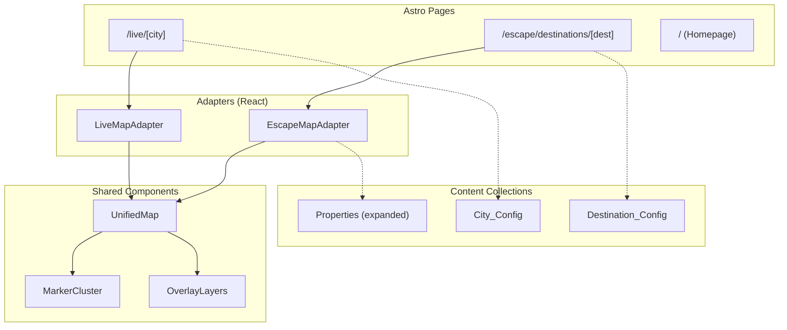
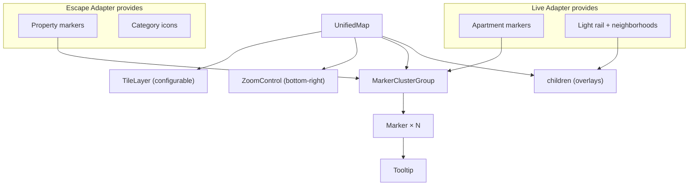

# Design Document: Unified Map Expansion

## Overview

This design extracts the existing `MapView.tsx` component (currently tightly coupled to the `/live` apartment vertical) into a shared, configurable `UnifiedMap` component that both verticals consume through vertical-specific adapters. It also introduces multi-city support for `/live`, international destination support for `/escape`, expanded vacation categories, a premium homepage redesign, and full responsive behavior.

The architecture follows an **Adapter pattern**: the `UnifiedMap` is a generic, prop-driven react-leaflet wrapper that knows nothing about apartments or properties. Each vertical provides a `Map_Adapter` that transforms its domain data into the generic `Marker_Descriptor` format the `UnifiedMap` consumes.

### Key Design Decisions

1. **Adapter over inheritance** — Rather than subclassing or forking the map, adapters transform domain data into a shared marker format. This keeps the map component pure and testable.
2. **Content collections for config** — City_Config and Destination_Config are Astro content collections (JSON files with Zod schemas), so adding a new city or destination requires zero code changes.
3. **CSS custom property theming** — The map reads cluster/overlay colors from the active vertical's CSS custom properties, maintaining visual cohesion without prop drilling color values.
4. **Lazy hydration preserved** — The UnifiedMap continues to use `client:visible` / `Suspense` + `lazy()` for Leaflet bundle splitting.

---

## Architecture



### Component Hierarchy



---

## Components and Interfaces

### UnifiedMap Component

```typescript
// src/components/map/UnifiedMap.tsx

interface MarkerDescriptor {
  id: string;
  position: { lat: number; lng: number };
  label: string;
  category: string;
  metadata: Record<string, unknown>;
}

interface MapThemeConfig {
  tileUrl: string;
  clusterBgColor: string;    // CSS custom property token
  clusterBorderColor: string;
  clusterTextColor: string;
  overlayBgColor: string;    // For tooltip/zoom control backgrounds
}

interface UnifiedMapProps {
  center: [number, number];           // [lat, lng]
  zoom: number;                        // 1–18
  markers: MarkerDescriptor[];
  clusterThreshold?: number;           // default: 10
  markerRenderer?: (descriptor: MarkerDescriptor) => L.Icon | L.DivIcon;
  onMarkerSelect?: (descriptor: MarkerDescriptor) => void;
  theme?: MapThemeConfig;
  disableDoubleTapZoom?: boolean;      // mobile: prevent conflict with browser zoom
  children?: React.ReactNode;          // overlay layers (polygons, polylines)
}
```

**Responsibilities:**
- Renders `MapContainer` with configurable center/zoom/tiles
- Clusters markers when count exceeds `clusterThreshold`
- Delegates marker rendering to `markerRenderer` prop (falls back to Leaflet default)
- Fires `onMarkerSelect` on marker click
- Applies theme tokens to cluster icons and overlays
- Passes `children` as non-clustered overlay content
- On mobile: disables double-tap zoom, enables touch pan/pinch-zoom

### LiveMapAdapter

```typescript
// src/components/map/LiveMapAdapter.tsx

interface LiveMapAdapterProps {
  apartments: Apartment[];
  favorites: string[];
  onSelectApartment: (apt: Apartment) => void;
  cityConfig: CityConfig;
}
```

**Responsibilities:**
- Transforms `Apartment[]` → `MarkerDescriptor[]` (filtering invalid coordinates)
- Provides score-colored marker renderer (existing `createCustomIcon` logic)
- Adds heart indicator for favorited apartments
- Passes light rail stations and neighborhood polygons as overlay children
- Centers map on `cityConfig.center` at `cityConfig.zoom`
- Invokes `onSelectApartment` with the `Apartment` from marker metadata

### EscapeMapAdapter

```typescript
// src/components/map/EscapeMapAdapter.tsx

interface EscapeMapAdapterProps {
  properties: SerializedProperty[];
  filters: RetreatFilterState;
  destinationConfig?: DestinationConfig;
  onSelectProperty: (property: SerializedProperty) => void;
  selectedProperty: SerializedProperty | null;
  onDismissCard: () => void;
}
```

**Responsibilities:**
- Transforms filtered `SerializedProperty[]` → `MarkerDescriptor[]`
- Provides category-specific marker renderer (unique icon per `VacationCategory`)
- Manages property summary card display (show/replace/dismiss)
- Centers map on destination coordinates when `destinationConfig` is provided
- Shows "no results" indicator when filtered markers are empty

### CitySelector

```typescript
// src/components/map/CitySelector.tsx

interface CitySelectorProps {
  cities: CityConfig[];
  currentCity: string;  // slug
}
```

**Responsibilities:**
- Renders alphabetically sorted city list
- Desktop: dropdown in toolbar area
- Mobile: full-width bottom sheet (via vaul Drawer)
- Navigates to `/live/[city-slug]` on selection

### DestinationBrowser

```typescript
// src/components/escape/DestinationBrowser.tsx

interface DestinationBrowserProps {
  destinations: DestinationConfig[];
}
```

**Responsibilities:**
- Groups destinations by `scope` (US / International)
- Alphabetical sort within each group
- Desktop: multi-column grid
- Mobile: scrollable vertical list or bottom sheet
- Links to `/escape/destinations/[slug]`

### PropertySummaryCard

```typescript
// src/components/escape/PropertySummaryCard.tsx

interface PropertySummaryCardProps {
  property: SerializedProperty;
  onClose: () => void;
}
```

**Responsibilities:**
- Displays name, region, price range (`$min–$max/night`), wow factor (truncated at 120 chars with ellipsis), link to `/escape/[region]/[slug]`
- Max width 250px on desktop overlay, full-width bottom sheet on mobile
- Close button and click-outside dismiss

### Homepage Sections

```typescript
// src/components/home/HeroSection.tsx
// src/components/home/VerticalCards.tsx
// src/components/home/FeaturedProperties.tsx
// src/components/home/SocialProof.tsx
// src/components/home/DestinationHighlights.tsx
// src/components/home/Footer.tsx
```

Each section is a standalone React component (or Astro component for static content) with framer-motion scroll-reveal animations. The `SocialProof` component uses `useInView` + animated counter.

---

## Data Models

### MarkerDescriptor

```typescript
interface MarkerDescriptor {
  id: string;                          // Unique identifier
  position: { lat: number; lng: number };
  label: string;                       // Display name
  category: string;                    // "apartment" | VacationCategory
  metadata: Record<string, unknown>;   // Vertical-specific payload
}
```

### CityConfig (Content Collection Schema)

```typescript
// Added to src/content/config.ts
const cityConfigs = defineCollection({
  loader: glob({ pattern: '**/*.json', base: './src/content/city-configs' }),
  schema: z.object({
    name: z.string(),
    slug: z.string().regex(/^[a-z0-9-]+$/),
    center: z.object({
      lat: z.number().min(-90).max(90),
      lng: z.number().min(-180).max(180),
    }),
    zoom: z.number().int().min(10).max(15),
    dataSource: z.string(),  // Reference to data file or collection
  }),
});
```

**Example file** (`src/content/city-configs/charlotte.json`):
```json
{
  "name": "Charlotte",
  "slug": "charlotte",
  "center": { "lat": 35.205, "lng": -80.845 },
  "zoom": 12,
  "dataSource": "charlotte"
}
```

### DestinationConfig (Content Collection Schema)

```typescript
const destinationConfigs = defineCollection({
  loader: glob({ pattern: '**/*.json', base: './src/content/destination-configs' }),
  schema: z.object({
    name: z.string(),
    slug: z.string().regex(/^[a-z0-9-]+$/),
    description: z.string().min(50),
    scope: z.enum(['us', 'international']),
    center: z.object({
      lat: z.number().min(-90).max(90),
      lng: z.number().min(-180).max(180),
    }),
    zoom: z.number().int().min(3).max(12),
  }),
});
```

### Expanded Property Schema (VacationCategory)

```typescript
// Updated property schema in src/content/config.ts
const VACATION_CATEGORIES = [
  'retreat', 'cruise', 'resort', 'villa', 'glamping', 'adventure', 'wellness'
] as const;

const properties = defineCollection({
  // ... existing loader
  schema: z.object({
    // ... existing fields
    stayType: z.enum(VACATION_CATEGORIES),  // Changed from z.string() to enum
    // ... rest unchanged
  }),
});
```

### MapThemeConfig

```typescript
interface MapThemeConfig {
  tileUrl: string;
  clusterBgColor: string;
  clusterBorderColor: string;
  clusterTextColor: string;
  overlayBgColor: string;
}

// Default themes per vertical
const LIVE_THEME: MapThemeConfig = {
  tileUrl: 'https://mt1.google.com/vt/lyrs=y&x={x}&y={y}&z={z}',
  clusterBgColor: 'var(--palette-accent-primary)',
  clusterBorderColor: '#ffffff',
  clusterTextColor: '#ffffff',
  overlayBgColor: 'var(--palette-surface-base)',
};

const ESCAPE_THEME: MapThemeConfig = {
  tileUrl: 'https://{s}.tile.openstreetmap.org/{z}/{x}/{y}.png',
  clusterBgColor: 'var(--palette-accent-primary)',
  clusterBorderColor: '#ffffff',
  clusterTextColor: '#ffffff',
  overlayBgColor: 'var(--palette-surface-base)',
};
```

### VacationCategory Icon Mapping

```typescript
const CATEGORY_ICONS: Record<string, { shape: string; color: string }> = {
  retreat: { shape: 'cabin', color: '#6b7c5a' },    // Moss
  cruise: { shape: 'ship', color: '#3b82f6' },      // Blue
  resort: { shape: 'palm', color: '#eab308' },      // Gold
  villa: { shape: 'house', color: '#a0543a' },      // Rust
  glamping: { shape: 'tent', color: '#8b5cf6' },    // Purple
  adventure: { shape: 'compass', color: '#f97316' }, // Orange
  wellness: { shape: 'lotus', color: '#14b8a6' },   // Teal
};
```

---

## Correctness Properties

*A property is a characteristic or behavior that should hold true across all valid executions of a system — essentially, a formal statement about what the system should do. Properties serve as the bridge between human-readable specifications and machine-verifiable correctness guarantees.*

### Property 1: Marker rendering count matches input

*For any* array of valid MarkerDescriptor objects passed to the UnifiedMap, the number of rendered markers on the map SHALL equal the length of the input array (when clustering is disabled or all markers are at distinct positions beyond cluster radius).

**Validates: Requirements 1.2**

### Property 2: Clustering threshold activation

*For any* set of MarkerDescriptor objects and any clustering threshold value T, IF the number of markers exceeds T, THEN the UnifiedMap SHALL enable marker clustering; IF the number is ≤ T, THEN markers SHALL render individually without clustering.

**Validates: Requirements 1.3**

### Property 3: Marker click delivers correct descriptor

*For any* MarkerDescriptor in the markers array, WHEN that marker is clicked, the `onMarkerSelect` callback SHALL receive the exact MarkerDescriptor object (same id, position, label, category, and metadata) that was used to render that marker.

**Validates: Requirements 1.6**

### Property 4: Live adapter transformation preserves apartment data

*For any* valid Apartment object with coordinates within [-90, 90] latitude and [-180, 180] longitude, the LiveMapAdapter transformation SHALL produce a MarkerDescriptor where `id` equals the apartment name, `position.lat` equals the apartment's lat, `position.lng` equals the apartment's lng, `label` equals the apartment name, `category` equals "apartment", and `metadata` contains the source Apartment object.

**Validates: Requirements 2.1**

### Property 5: Score-to-color mapping correctness

*For any* overallScore value between 0 and 10, the score-to-color function SHALL return green for scores ≥ 8, lime for scores ≥ 7 and < 8, yellow for scores ≥ 6 and < 7, orange for scores ≥ 5 and < 6, and red for scores < 5.

**Validates: Requirements 2.2**

### Property 6: Favorites indicator matches list membership

*For any* apartment name and any favorites list, the marker for that apartment SHALL display a heart indicator if and only if the apartment name is present in the favorites list.

**Validates: Requirements 2.3**

### Property 7: Invalid coordinates are excluded

*For any* set of Apartment objects where some have coordinates outside the valid range (latitude outside [-90, 90] or longitude outside [-180, 180]), the LiveMapAdapter SHALL produce a MarkerDescriptor array containing only apartments with valid coordinates, and the output array length SHALL equal the count of input apartments with valid coordinates.

**Validates: Requirements 2.6**

### Property 8: Escape adapter transformation preserves property data

*For any* valid SerializedProperty object, the EscapeMapAdapter transformation SHALL produce a MarkerDescriptor where `position` matches the property's coordinates, `label` equals the property name, `category` equals the property's stayType (VacationCategory), and `metadata` contains the region, price range, and source property.

**Validates: Requirements 3.1**

### Property 9: Category icon uniqueness

*For any* two distinct VacationCategory values from the enum (retreat, cruise, resort, villa, glamping, adventure, wellness), the marker icon mapping function SHALL produce visually distinct icons (different shape, color, or symbol) such that no two categories share the same icon appearance.

**Validates: Requirements 3.2, 6.5**

### Property 10: Summary card content completeness and truncation

*For any* SerializedProperty, the PropertySummaryCard SHALL render content containing the property name, region, price range formatted as "$min–$max/night", and wow factor text. IF the wow factor exceeds 120 characters, THEN the displayed text SHALL be truncated to 120 characters followed by an ellipsis ("…"), resulting in a displayed length of exactly 121 characters (120 + ellipsis).

**Validates: Requirements 3.3**

### Property 11: Filter criteria determines visible markers

*For any* set of properties and any combination of active filter criteria (regions, stay types/categories, price range, max drive time, selected origin, min privacy, amenities), the set of visible markers on the escape map SHALL be exactly the subset of properties that satisfy ALL active filter criteria simultaneously.

**Validates: Requirements 3.7, 6.3**

### Property 12: Content collection schema validation

*For any* JSON object, the CityConfig schema SHALL accept it if and only if it contains a valid name (string), slug (matching `^[a-z0-9-]+$`), center coordinates (lat in [-90, 90], lng in [-180, 180]), zoom (integer in [10, 15]), and dataSource (string). The DestinationConfig schema SHALL accept it if and only if it contains a valid name, slug, description (≥50 chars), scope ("us" or "international"), center coordinates, and zoom (integer in [3, 12]). The VacationCategory enum SHALL accept only the defined values (retreat, cruise, resort, villa, glamping, adventure, wellness) and reject all others.

**Validates: Requirements 4.1, 5.1, 6.1**

### Property 13: Alphabetical ordering in selectors

*For any* set of city names in the CitySelector, the displayed order SHALL be alphabetical (case-insensitive). *For any* set of destinations within the same geographic scope group in the DestinationBrowser, the displayed order SHALL be alphabetical (case-insensitive) within each group.

**Validates: Requirements 4.4, 5.5**

### Property 14: Property card displays category badge

*For any* SerializedProperty with a valid VacationCategory, the PropertyCard component SHALL render a visible badge element whose text content matches the property's category value.

**Validates: Requirements 6.6**

---

## Error Handling

### Map Component Errors

| Error Condition | Handling Strategy |
|---|---|
| Empty markers array | Render base map without markers, no error state |
| Invalid coordinates in apartment data | Silently filter out invalid entries in adapter |
| Tile layer fails to load | Leaflet handles gracefully with grey tiles; no custom error UI needed |
| MarkerClusterGroup receives 0 markers | Renders nothing (react-leaflet-cluster handles this) |
| Custom marker renderer throws | Catch in adapter, fall back to default Leaflet icon for that marker |

### Routing Errors

| Error Condition | Handling Strategy |
|---|---|
| Invalid city slug (`/live/[invalid]`) | Render 404 page with navigation back to city selector |
| Invalid destination slug (`/escape/destinations/[invalid]`) | Render 404 page |
| City with no apartment data | Render map at city center with "No apartments available" message |
| Destination with no properties | Render map at destination center with "No properties available" message |

### Content Collection Errors

| Error Condition | Handling Strategy |
|---|---|
| City_Config JSON fails Zod validation | Build-time error (Astro content collection behavior) |
| Destination_Config fails validation | Build-time error |
| Property missing required VacationCategory | Build-time error via Zod enum validation |
| Featured properties returns empty | Homepage hides featured section entirely |

### Filter State Errors

| Error Condition | Handling Strategy |
|---|---|
| All filters active, zero results | Show empty state with "No properties match" message and reset button |
| Invalid filter values in URL params | Reset to defaults (existing behavior in `use-retreat-filters`) |

---

## Testing Strategy

### Property-Based Testing (fast-check)

This feature is well-suited for property-based testing because it contains:
- Pure transformation functions (adapter transforms, score-to-color mapping, coordinate validation)
- Universal filtering logic (filter criteria → visible set)
- Schema validation (Zod schemas with defined valid/invalid input spaces)
- Ordering guarantees (alphabetical sorting)

**Library:** `fast-check` (already in devDependencies)
**Configuration:** Minimum 100 iterations per property test
**Tag format:** `Feature: unified-map-expansion, Property {number}: {property_text}`

Each correctness property (1–14) maps to a single `fast-check` property test.

### Unit Tests (vitest)

Unit tests cover specific examples, edge cases, and integration points:

- **Edge cases:** Empty markers, zero filter results, missing coordinates, wow factor exactly 120 chars, slug boundary values
- **Integration:** Filter sidebar ↔ map marker sync, city selector navigation, destination browser grouping
- **Rendering:** Summary card dismiss behavior, bottom sheet on mobile, category badge presence
- **Responsive:** Verify correct component variant renders based on viewport (using `useIsMobile` hook)

### Component Tests (@testing-library/react)

- UnifiedMap renders with correct props
- LiveMapAdapter passes overlays as children
- EscapeMapAdapter shows/hides summary card
- CitySelector renders alphabetical list
- DestinationBrowser groups by scope
- PropertyCard shows category badge
- Homepage sections render conditionally (featured hidden when empty)

### Visual / Manual Testing

- Responsive breakpoint behavior (768px, 1024px)
- Touch gesture handling on mobile devices
- Scroll-reveal animation timing
- LCP performance budget (Lighthouse audit)
- Cluster icon sizing on mobile (≥36px)
- Tap target compliance (≥44×44px)

